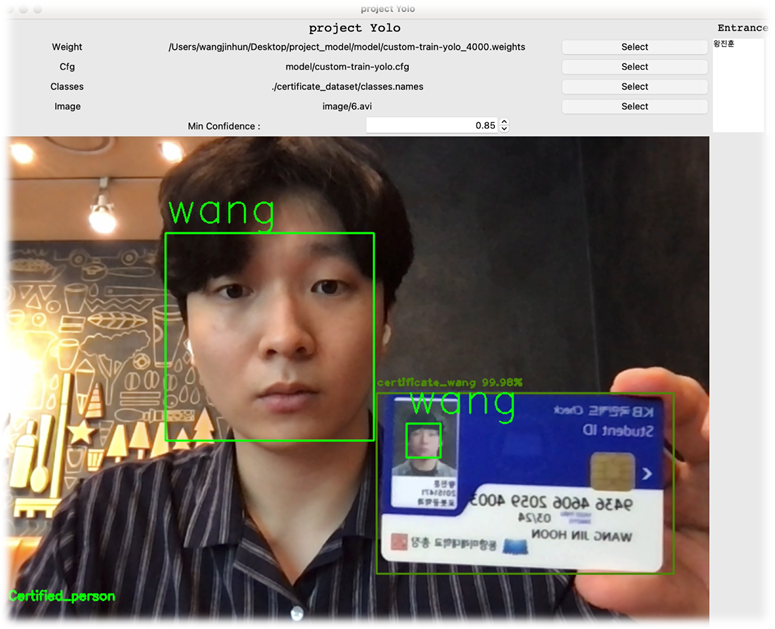

# object_detection

### 사용 기술 스택 : Python, face_recognition, Yolo3, tracking
### 사용할 툴 : face_recognition, yolov3, OpenCV
### 사용 언어 : Python
-------
### 내용
카메라를 통한 얼굴과 출입증을 인식하여 사람을 식별, 트래킹 하게됩니다.

식별된 사람이 가상의 선을 지나가면 들어간 시간이 찍히고 식별되지 않은 사람이 들어가려 하면 화면을 어둡게하여 식별되지 않은자가 들어갔다고 알려줍니다.
식별되지 않은 자는 학습된 자여도 출입증이 없는 사람이거나, 다른사람의 출입증을 들고온다거나, 아예 학습되지 않은 사람을 의미합니다.

[관련 Notion 링크](https://tasteful-dianella-4f4.notion.site/c9c65178a7924578b213029bd4d4550a)  
[관련 영상 링크](https://youtu.be/BhmaxMiq5X8)
